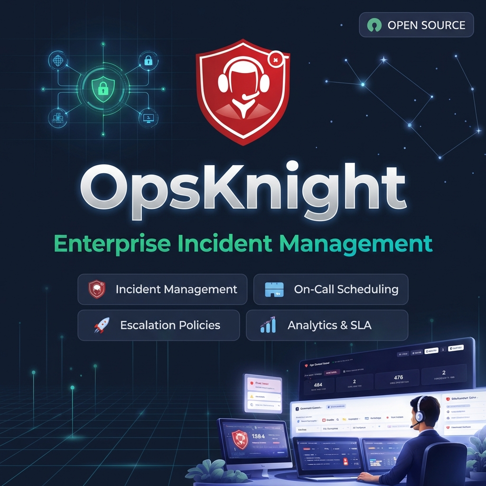

<div align="center">



# 🛡️ OpsKnight

**Open-Source Incident Management Platform**

[](https://nextjs.org/)
[](https://www.typescriptlang.org/)
[](https://www.prisma.io/)
[](https://opsknight.com)
[](LICENSE)

<div align="center">
  <h3>
    <a href="https://opsknight.com" target="_blank">
      🌐 Visit Website: opsknight.com
    </a>
  </h3>
</div>

[**Documentation**](docs/) • [**Quick Start**](#-quick-start) • [**Features**](#-features) • [**API**](docs/api/)

</div>

---

## ✨ Features

- 🚨 **Incident Management** - Complete lifecycle from trigger to resolution
- 📅 **On-Call Scheduling** - Flexible rotations, overrides, and layers
- 📈 **Escalation Policies** - Multi-tier escalation with user/team/schedule targets
- 📊 **Analytics & SLA** - MTTA, MTTR, and SLA compliance tracking
- 🌐 **Status Page** - Public-facing service status with subscriber notifications
- 🔔 **Multi-Channel Alerts** - SMS, Push, Email, Slack, WhatsApp
- 📱 **Mobile PWA** - Install on any device with push notifications
- 🔐 **Enterprise Security** - SSO/OIDC, RBAC, audit logs

---

## 🚀 Quick Start

### Docker Compose

```bash
# Clone and configure
git clone https://github.com/dushyant-rahangdale/opsknight.git
cd opsknight
cp env.example .env

# Start services
docker compose up -d

# Create admin user
docker exec -it opsknight_app npm run opsknight -- \
  --user "Admin" \
  --email admin@example.com \
  --password SecurePass123! \
  --role admin
```

Open **http://localhost:3000** and sign in.

---

## 📚 Documentation

| Section                                      | Description                                       |
| -------------------------------------------- | ------------------------------------------------- |
| [**Getting Started**](docs/getting-started/) | Installation, first steps, configuration          |
| [**Core Concepts**](docs/core-concepts/)     | Services, Incidents, Teams, Schedules, Escalation |
| [**Administration**](docs/administration/)   | Authentication, Notifications, Data Retention     |
| [**Integrations**](docs/integrations/)       | Slack, Webhooks, Monitoring Tools                 |
| [**API Reference**](docs/api/)               | REST API documentation                            |
| [**Deployment**](docs/deployment/)           | Docker, Kubernetes, Mobile PWA                    |
| [**Roadmap**](ROADMAP.md)                    | Future plans and feature tracking                 |

---

## 🔌 Integrations

<p align="center">
  
  
  
  
  
</p>

See [Integrations Documentation](docs/integrations/) for setup guides.

---

## 🛠️ CLI

```bash
# Create/update users
npm run opsknight -- --user "Name" --email user@example.com --password Pass123! --role responder
```

See [CLI Documentation](docs/api/cli.md) for full usage.

---

## 🤝 Contributing

We welcome contributions! Please see our [Contributing Guide](CONTRIBUTING.md) and review our [Code of Conduct](CODE_OF_CONDUCT.md) for details.

---

## 🔒 Security

For reporting security vulnerabilities or reviewing our security policy, please see [SECURITY.md](SECURITY.md).

---

## 📄 License

OpsKnight is licensed under the [Apache License 2.0](LICENSE).

---

<div align="center">
  <sub>Built with ❤️ for SREs and DevOps Teams</sub>
</div>
